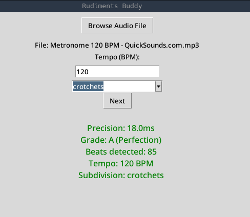

# Rudiments buddy

Percussion practice precision analyzer - measures timing precision against ideal metronome grid. 
Project stemmed from the need to precisely measure and grade rudiments progress. I'm learning percussion for about a year now 
and I wanted to see how I've progressed so far. 



## Features

- beat detection using special module for Music Information Retrival - librosa
- subdivision support (crotchets/quavers/semiquavers)
- real-time precision calculation
- visualization of precision by grades (A-F) and corresponding color
- tkinter basic GUI

## Installation 

```commandline bash
git clone https://github.com/Rac00nCanFly/rudiments-buddy
cd rudiments-buddy
pip install -r requirements.txt
```

## Usage
```commandline
python backend/app.py
```
1. Click "Browse Audio Files" -> select your audio from practice (WAV/MP3)
2. Enter tempo BPM e.g.: 120
3. Select subdivision:
   - Crotchets (quarter notes) - 1 beat 
   - Quavers (eighth notes) - 2 beats 
   - Semiquavers (16th notes) - 4 beats
4. Click "Next"
5. You can see your timing precision and grade against real-life metronome recording

## How it works

1. **Beat Detection**: librosa.onset_detect() identifies each drum hit
2. **Ideal Grid**: 60s / tempo / subdivision calculates perfect timing
   - Example: 120 BPM, semiquavers → 0.125s intervals
3. **Error Calculation**: Mean absolute difference
4. **Grading Scale**:
   - A (<20ms): Perfection
   - B (20-40ms): Very good
   - C (40-70ms): Good
   - D (70-100ms): Practice more
   - F (>100ms): Restart

## Future improvements

This app is in really simple form now, but I plan on implementing more features in the future:
- as I will be progressing with rudiments I will add more of them to the library
- more appealing GUI by implementing Flask and switching to Web UI so I can host this app on my local server
- exporting results to CSV and adding feature to compare previous results in a graphic form